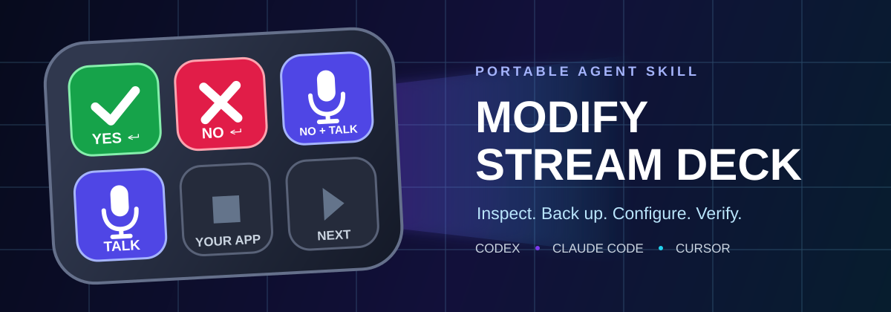

<p align="center">
  
</p>

<h1 align="center">Modify Stream Deck</h1>

<p align="center"><strong>Let your coding agent configure Stream Deck buttons without gambling with your profile.</strong></p>

<p align="center">
  <a href="LICENSE"></a>
  <a href="https://github.com/TomGranot/modify-stream-deck-skill/actions/workflows/validate.yml"></a>
  <a href=".agents/skills/modify-stream-deck/SKILL.md"></a>
  
</p>

<p align="center">
  <a href="#install-the-skill"><strong>Install</strong></a> ·
  <a href="#configure-a-button">Use it</a> ·
  <a href="#four-button-coding-starter">Starter layout</a> ·
  <a href=".agents/skills/modify-stream-deck/references/spec-format.md">Spec reference</a> ·
  <a href="SECURITY.md">Safety</a>
</p>

This portable Agent Skill lets Codex, Claude Code, Cursor, and other Agent Skills hosts inspect and modify Elgato Stream Deck profiles. It finds the right page, preserves unrelated keys, creates a full backup, installs icons, writes the replacement atomically, and restarts Stream Deck.

The bundled helper supports text, physical hotkeys, URLs, application paths, ordered Multi Actions, and two-state Multi Action Switches. It uses an explicit Return hotkey for “type and submit,” which works in prompt and terminal fields that ignore Stream Deck's Text-action Enter flag.

## Requirements

- macOS with Elgato Stream Deck 7.x;
- Python 3.10 or newer;
- a coding agent that supports the open Agent Skills format.

The profile helper uses only Python's standard library. We tested it on an Elgato Stream Deck Mini with Stream Deck 7.5.1 on macOS and against synthetic V3 fixtures. We have not tested another Stream Deck model or Windows.

## Install the skill

Install the portable skill with the open Skills CLI:

```bash
npx skills add TomGranot/modify-stream-deck-skill \
  --skill modify-stream-deck \
  -g
```

List the discovered package before installing:

```bash
npx skills add TomGranot/modify-stream-deck-skill --list
```

### Claude Code plugin

Add the repository as a marketplace and install the plugin:

```text
/plugin marketplace add TomGranot/modify-stream-deck-skill
/plugin install modify-stream-deck@stream-deck-skills
/reload-plugins
```

You can also clone the repository and test it without installation:

```bash
git clone https://github.com/TomGranot/modify-stream-deck-skill.git
cd modify-stream-deck-skill
claude --plugin-dir .
```

### Codex and Cursor from a clone

Both hosts discover the canonical project skill at `.agents/skills/modify-stream-deck/`. Clone the repository and work from its root, or copy that directory into your user-level Agent Skills folder.

## Configure a button

Ask your agent for the behavior, location, and icon:

```text
Use the modify-stream-deck skill. Back up my active profile, then make the
top-left key type "yes" and press a physical Return. Give it a green check icon.
Preserve every other button and show me the validation result.
```

The skill guides the agent through discovery, a dry-run, backup, atomic replacement, app reload, and verification. It tells the agent not to test a submitting button in your active field.

To use the helper directly:

```bash
python3 .agents/skills/modify-stream-deck/scripts/streamdeck_profile.py discover

python3 .agents/skills/modify-stream-deck/scripts/streamdeck_profile.py apply \
  --manifest "/path/to/page/manifest.json" \
  --spec ".agents/skills/modify-stream-deck/assets/four-button-coding.json" \
  --dry-run

python3 .agents/skills/modify-stream-deck/scripts/streamdeck_profile.py apply \
  --manifest "/path/to/page/manifest.json" \
  --spec ".agents/skills/modify-stream-deck/assets/four-button-coding.json" \
  --restart-app
```

The apply command refuses invalid coordinates, verifies every icon, copies the full `.sdProfile` bundle, preserves untouched coordinates, and writes complete V3 action lanes and runtime provider metadata.

## Four-button coding starter

<p align="center">
  
</p>

The sanitized starter spec at [four-button-coding.json](.agents/skills/modify-stream-deck/assets/four-button-coding.json) contains:

| Position | First press | Second press |
| --- | --- | --- |
| Top left | Type `yes`, then send a physical Return | Same action |
| Top middle | Type `no`, then send a physical Return | Same action |
| Top right | Type `no `, then start hands-free Wispr Flow dictation | Stop dictation |
| Bottom left | Start hands-free Wispr Flow dictation | Stop dictation |

Coordinates are examples, not assumptions about your hardware. The skill inspects the active page before applying them.

The dictation buttons launch two small background apps: one sends the app's start URL and one sends its stop URL. The wrappers use `open -g -u`, which sends the URL without bringing the dictation app forward. They do not select an application or search for a textbox, so your current text field keeps focus. Your existing keyboard shortcut can remain in place.

## Focus-safe dictation controls on macOS

Some dictation apps expose registered URLs for hands-free start and stop. Stream Deck can call those URLs directly, but doing so may foreground the dictation app and steal focus from the field where you planned to dictate.

Create two background app wrappers instead. Replace the example protocol with the start and stop URLs from your dictation app's documentation:

```bash
python3 .agents/skills/modify-stream-deck/scripts/create_background_protocol_app.py \
  --display-name "Dictation Start" \
  --url "example-dictation://start-hands-free" \
  --output-dir "$HOME/Applications"

python3 .agents/skills/modify-stream-deck/scripts/create_background_protocol_app.py \
  --display-name "Dictation Stop" \
  --url "example-dictation://stop-hands-free" \
  --output-dir "$HOME/Applications"
```

The generator compiles a minimal macOS app with `LSUIElement` set, so it has no Dock presence. Its only action is `open -g -u '<protocol URL>'`. Configure the Stream Deck buttons as **Open Application** actions that point to those two app bundles. The bundled starter already uses these paths:

```text
~/Applications/Dictation Start.app
~/Applications/Dictation Stop.app
```

Run the generator with `--dry-run` first if you want to inspect the AppleScript. It refuses paths that would overwrite an existing app.

### Approaches that failed and why

| Attempt | Why it failed | Use this instead |
| --- | --- | --- |
| Direct URL action | The protocol reached the app but could foreground it, moving focus away from the target text field. | Call the URL through a background app built by this repository. |
| Modifier-only shortcut | A shortcut made of only modifiers does not give Stream Deck a normal key event to send. | Use a real key in the shortcut, or use a background protocol app. |
| `Fn` in a Stream Deck hotkey | Stream Deck's Hotkey action does not model the Mac's `Fn` modifier as a reliable synthetic key. | Keep the physical `Fn` shortcut and use a background protocol app for the deck. |
| Push-to-talk shortcut | Stream Deck sends a quick press and release. A push-to-talk binding starts and stops before dictation can continue. | Configure a hands-free command or call separate start and stop URLs. |
| Open a `.command` script | Stream Deck 7.5 did not reliably execute a shell script selected through its Open action. | Compile a real `.app` with the generator, then use Open Application. |
| Two built-in Multi Action Switches | Each switch stores its own state. One cannot change the other button's STOP icon. | Accept independent indicators or build a custom Stream Deck SDK plugin that owns shared state. |

The generated wrappers do not press Return when dictation stops. Add a separate deliberate submit action only when the destination supports it safely.

## Supported button recipes

| Recipe | Use it for |
| --- | --- |
| `text` | Type without submitting |
| `submit_text` | Type, then send a physical Return |
| `hotkey` | Send Return, Space, Tab, Escape, or a supported modifier combination |
| `url` | Open a web page or registered app protocol |
| `open` | Open an application or file path |
| `sequence` | Run several actions in order |
| `toggle_sequence` | Alternate between start and stop routines with separate icons |
| `remove` | Clear one named coordinate |

Read the [spec reference](.agents/skills/modify-stream-deck/references/spec-format.md) for exact fields and examples.

## Safety model

Direct profile editing is powerful because a Stream Deck key can submit text, delete data, or trigger an external action. The skill therefore requires:

- a full pre-change profile backup;
- a dry-run before each write;
- atomic manifest replacement;
- preservation checks for untouched coordinates;
- no live testing in a consequential field;
- no credentials, device serials, profile UUIDs, account identifiers, or live manifests in public examples.

If Stream Deck rewrites a profile during the change, restore the backup and use the visible editor. Do not race repeated writes against the application.

## Known limitation

A Multi Action Switch tracks button presses, not the state of another app. If you stop dictation with a separate keyboard shortcut, the Stream Deck icon can remain on STOP until the next button press resets it.

Use a background protocol app when a dictation URL must act on the current text field. A direct URL action may move focus to the app that owns the protocol.

If an icon renders but the key shows ⚠️ when pressed, inspect the action's V3 shape. Multi Actions need top-level `Actions` lanes, and each nested step needs its own `ActionID`, `Plugin`, and `Resources`. Legacy `Settings.Routine` data can render but does not execute in the V3 profile format used by Stream Deck 7.4.

## Validate the repository

```bash
python3 -m unittest discover -s tests -v
python3 ~/.codex/skills/.system/skill-creator/scripts/quick_validate.py \
  .agents/skills/modify-stream-deck
uvx --from skills-ref agentskills validate \
  .agents/skills/modify-stream-deck
```

## Contributing

Read [CONTRIBUTING.md](CONTRIBUTING.md) before adding a recipe or platform. New action types need a fixture test, failure behavior, and a public example without live profile data.

## License

[MIT](LICENSE)
